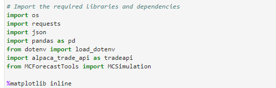
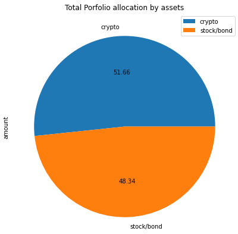
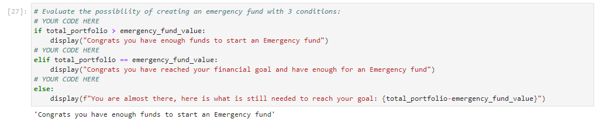
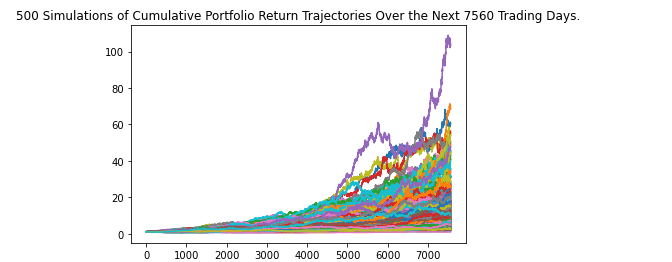
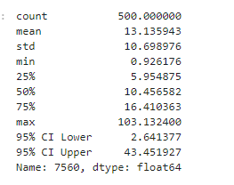

# Challenge_5_Financial_Planning_Application
This application is a financial analysis tool that will be utilized by credit union members to assess their current savings (Crypto Currencies, Stocks, & Bond Holdings) and forecast their retirement portfolio (current savings) in 30 years. There is an additional feature of the application which assess if the member has enough funds to create an Emergency fund and communicates that to them.

---
## Technologies
The programming language used for this analysis was **Python (v 3.9.7)**.

The applicable libraries needed to run this analysis are:
>

---
## Installation Guide
All of the above libraries should be part of the base applications that were installed with the Python version above; if not, you will have to install them through the pip package manager of Python.

Please note, an Alpaca key and Alpaca secret key will be needed for the download of the current closing prices of the SPDR S&P 500 EFT Trust (Ticker:SPY) and of the iShares Core US Aggregate Bond EFT (Ticker:AGG). 

---
## Contributor

James Handral
james.handral@gmail.com

---
## License

N/A

---
## Application Summary

1) The application gets the current prices for the SPY, AGG and Cryptocurrency assets ((BTC and ETH)) which makes up the credit union members investment holdings from an API call. The current prices are multiplied by the shares the member has for each asset to get their current nominal value. With that information a pie chart is created showing them their asset allocation

2) An additional feature with the budget section of the application is a function to determine if a member has enough funds (3 times thier monthly income ) to create an Emergency Fund. 

3) Finally the application offers members the capability to forecast their current savings for 30 years. The MCSimulation algorithm from the MCForecastTools library is utilized for the 30 year forecast which provides a 95% Confidence Interval, which is a upper and lower bound range of potential returns on investments. 

|
-|-

